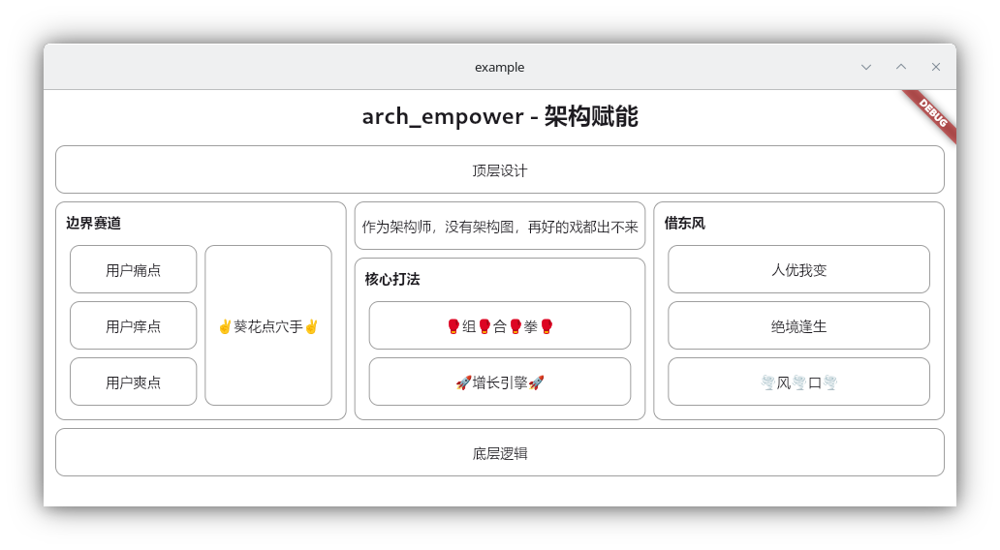

# arch_empower - 架构赋能

> 有没有觉得绘制架构图很麻烦？有没有想过用代码生成架构图？有没有想过架构图可以自适应不同的屏幕宽度？

`arch_empower` 是一个基于 Flutter 的架构图绘制工具，让开发者能够以极高的效率生成美观、响应式的架构图。



## 特点

- **声明式语法**：使用简洁的 Dart 代码，以声明式的方式定义架构图的结构和样式。
- **组件化设计**：提供了 `Graph`、`Group`、`Box`、`R`、`C` 等基本组件，可以灵活组合，快速构建复杂的架构图。
- **响应式布局**：利用 Flutter 强大的布局能力，生成的架构图能够自适应不同的宽度，具有响应式特性。
- **可扩展性**：生成的架构图本身就是一个 Flutter 应用，可以对其进行进一步的扩展和定制。
- **Web 支持**：可以将生成的架构图构建成 Web 应用，形成可交互的架构图，增强演示和展示效果。

## 安装

将以下内容添加到你的 `pubspec.yaml` 文件中：

```yaml
dependencies:
  arch_empower: ^1.0.0
```

然后运行 `flutter pub get` 命令安装依赖。

## 使用方法

1. 导入 `arch_empower` 库：

```dart
import 'package:arch_empower/arch_empower.dart';
```

2. 使用提供的组件构建架构图：

```dart
Graph(
  title: 'arch_empower - 架构赋能',
  child: C(
    children: [
      Box(title: '顶层设计'),
      R(children: [
        Group(
          title: "边界赛道",
          child: R(children: [
            C(children: [
              Box(title: '用户痛点'),
              Box(title: '用户痒点'),
              Box(title: '用户爽点'),
            ]),
            Box(title: '✌️葵花点穴手✌️'),
          ]),
        ),
        // ...
      ]),
      Box(title: '底层逻辑')
    ],
  ),
)
```

3. 运行 Flutter 应用，查看生成的架构图。

## 组件说明

- `Graph`：架构图的根组件，表示整个架构图。
- `Group`：表示一个分组，可以包含其他组件。
- `Box`：表示一个矩形框，用于显示具体的架构元素。
- `R`：表示一个横向的 Row 布局。
- `C`：表示一个纵向的 Column 布局。

通过组合这些基本组件，可以快速构建出复杂的架构图。

## 示例

查看更多示例，请参考 [example](example) 目录。

## 许可证

arch_empower 采用 MIT 许可证进行发布。详细信息请参阅 [LICENSE](LICENSE) 文件。

## 关于作者

我是 Maeiee（Maxiee），欢迎访问我的[个人网站](https://maxieewong.com/)。

如果你觉得 arch_empower 对你有帮助，欢迎在爱发电上支持我的工作：

[maeiee正在创作技术写作，分享互联网技术 | 爱发电](https://afdian.net/a/maeiee)


## 联系方式

如果你在使用中遇到任何问题或有任何建议，欢迎随时与我们联系。你可以通过以下方式联系我们：

- 提交 issue：[https://github.com/maxiee/arch_empower/issues](https://afdian.net/a/maeiee)

我们会尽快回复并解决你的问题。

希望 arch_empower 能够为你的架构设计工作带来便利和效率提升！